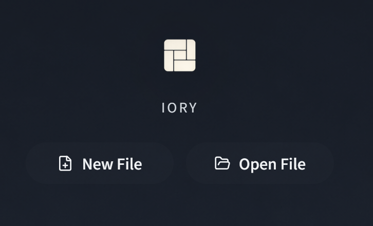
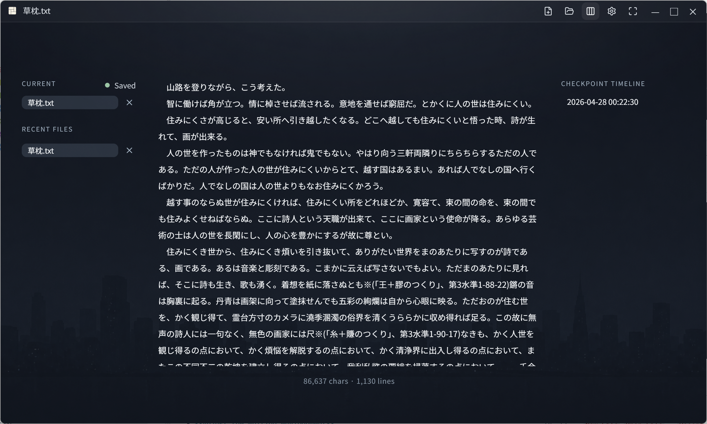
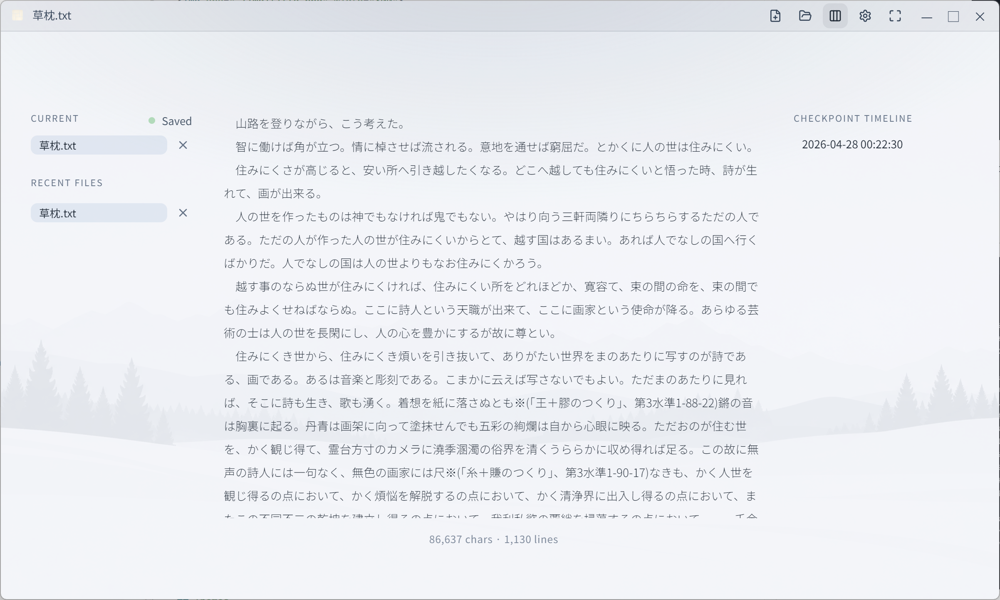
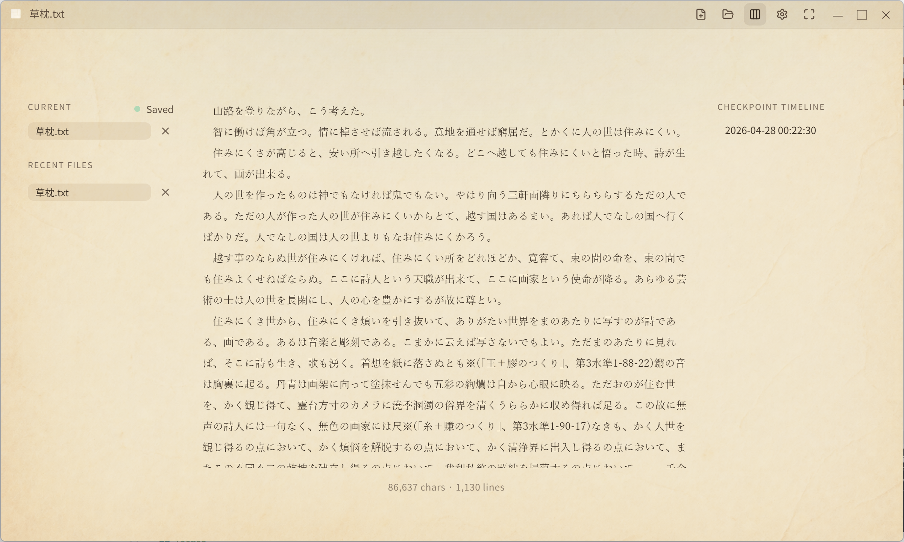
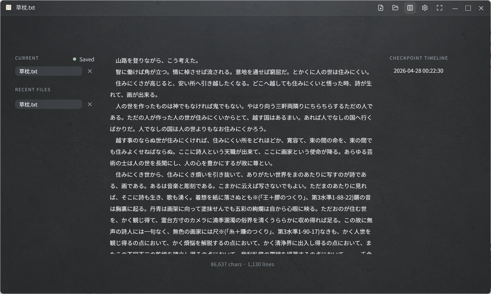

English | [日本語](./README.ja.md)

# IORY - writer's retreat of Zen

IORY: A desktop app that crafts an 'iori' – a zen-inspired minimalist retreat. Distraction-free text editor for pure, focused writing.

**[Try the web demo →](https://ymkn.github.io/iory/)**

## Screenshots & Themes

 

## Fullscreen-focus mode

No UI. Pure text canvas.

## Web demo

IORY also has a **limited GitHub Pages demo** for quick trial use in the browser.

- The **desktop app is the real version**.
- The **web demo is intentionally limited** and should be treated as a preview only.
- In the web demo, drafts are autosaved to **IndexedDB in your browser**.
- The web demo does **not** write back to your local filesystem while you type.
- If you want a file on disk, use the **Download** button to export a copy manually.
- Browser data can be cleared by the user or the browser, so the web demo is **not** the recommended place for important writing.

If you want the full IORY experience — direct local-file editing, stronger save semantics, and the intended desktop UX — use the installable app.

## What you can do

- **Focus on one file at a time**  
  Start from `New File`, `Open File`, or `Recent files`, then stay with the document you are writing.

- **Edit your local files directly**  
  Your document remains a file on disk. You can keep writing without being locked into an app-specific format.

- **Autosave by default**  
  You do not need to keep thinking about saving while you write.

- **Create explicit checkpoints with Ctrl+S**  
  Manual save can leave a local checkpoint when you want to preserve a specific moment.

- **Restore from the checkpoint timeline**  
  You can go back through saved snapshots and restore an earlier state.

- **Switch themes**  
  Choose between Night Blue, Snow, Ash, and Warm Paper.

- **Adjust the writing environment**  
  Tune font, line height, content width, count mode, background style, and checkpoint interval.

## Who it is for

- Writers who want to focus on the text before anything else
- People who prefer writing quietly in one file at a time
- Anyone who wants autosave and history as a safety net

## About local history

Checkpoints and restore history are stored locally in the app's settings directory, not in the cloud. They exist to protect your writing on your device, not as a sync or sharing feature.

In the web demo, equivalent history is stored only inside your browser for demo purposes.
